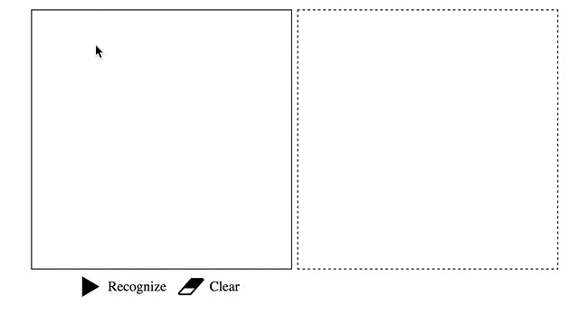

# node-cntk-mnist-sample

This sample node.js web application demonstrates how the <a href="https://github.com/nadavbar/node-cntk" target="_blank">node-cntk</a> module can be used to host <a href="https://www.microsoft.com/en-us/cognitive-toolkit" target="_blank">CNTK</a> models inside a node.js web-server.

The hosted model in this web app consists of a Convolutional Neural Network that was trained on the <a href="http://yann.lecun.com/exdb/mnist/" target="_blank">MNIST dataset</a>.

For more information regarding the training procedure and the architecture of the model, please refer to the following <a href="https://github.com/Microsoft/CNTK/blob/master/Tutorials/CNTK_103D_MNIST_ConvolutionalNeuralNetwork.ipynb" target="_blank">CNTK tutorial</a>.

 

Currently, this example only runs on Windows x64.

## Instructions

Clone this repository:
```
git clone https://github.com/nadavbar/node-cntk-mnist-sample
```

Setup the dependencies:

```
cd node-cntk-mnist-sample
npm install
```

Run the web-server:
```
npm start
```

Browse to http://localhost:3000 and test the app!